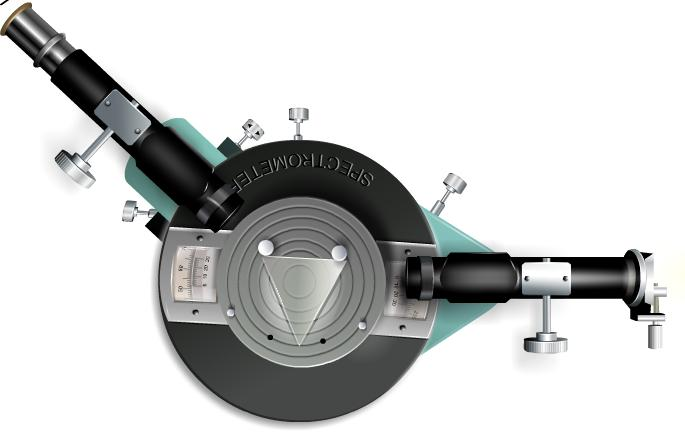
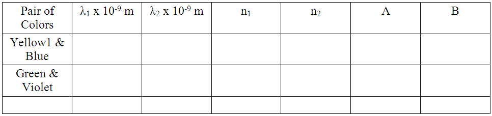
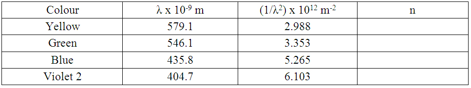
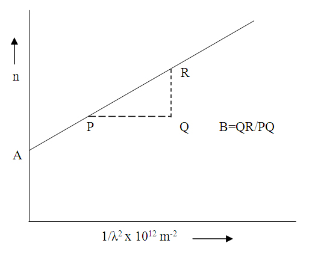

## Procedure

### Apparatus:

Spectrometer, prism, prism clamp, Magnifying glass, mercury vapor lamp, etc.

### Controls
#### Switches
- **Switch On/Off Light** : Used to switch on/off the light.
- **Place Prism/Remove Prism** : This switch used to place the prism on the prism table or remove prism from the prism table.
#### Slider
- **Slit focus** : This slider used to focus the slit while looking through telescope.
- **Slit width** : Using this slider, width of the slit can be adjusted.
- **Telescope**: Using this slider one can move the telescope from its position.
- **Vernier Table**: Vernier table can be rotate using this slider.
#### Fine Angle adjustment
- **Telescope**: This is used to fine adjust the telescope.
- **Vernier Table**: Using this slider , we can rotate fine angle.
#### Measurements
- The zoomed view of Vernier I and II can be used to note the readings.
 

### Preliminary adjustments:
#### Performing simulator

- Focus Telescope on distant object.
- When focus is correct, start button is activated. Then click Start button.
- Switch on the light by clicking Switch On Light button.
- Focus the slit using Slit focus slider.
- Adjust the slit width using Slit width slider.
- Coincide the slit with cross wire in the telescope.

#### Performing Real Lab:
 
1. Turn the telescope towards the white wall or screen and looking through eye-piece, adjust its position till the cross wires are clearly seen.
2. Turn the telescope towards window, focus the telescope to a long distant object.
3. Place the telescope parallel to collimator.
4. Place the collimator directed towards sodium vapor lamb. Switch on the lamp.
5. Focus collimator slit using collimator focusing adjustment.
6. Adjust the collimator slit width.
7. Place prism table, note that the surface of the table is just below the level of telescope and collimator.
8. Place spirit level on prism table. Adjust the base leveling screw till the bubble come at the centre of spirit level.
9. Clamp the prism holder.
10. Clamp the prism in which the sharp edge is facing towards the collimator, and base of the prism is at the clamp.

### Least Count of Spectrometer

One main scale division (N)  =................minute

Number of divisions on vernier (v) = ................

L.C  = $\frac{N}{v}$ = ................ minute

### To determine the angle of the Prism:
Please refer to the experiment 'Angle of Prism"

### To determine the Cauchy's constants for the prism:

#### Performing Real Lab 
 

The angle of the prism $A$ and the angle of minimum deviation $D$ for different wave length are determined. From this the refractive index $n$ for these colours are calculated. Taking the value of $\lambda$ from the mathematical table, the Cauchy's constants A and B are calculated for different pairs of spectral colours using the equation.

$$n=A+\frac{B}{\lambda^{2}}$$
 

The Cauchy's constants can also be determined graphically. A graph is drawn with $n$ along the y-axis and $1/\lambda^{2}$ along x-axis with zero as the origin for both axes. The graph is a straight line. The Y intercept gives A and the slope gives B.

####  Performing simulator

  

 

1. Rotate the vernier table so as to fall the light from the collimator to one face of the prism and emerged through another face. (refer the given figure ).
2. The emerged ray has different colors.
3. Turn the telescope to each color, and note the readings for different colors.
4. Remove the prism, hence note direct ray reading.
5. Find the angle of minimum deviation for different color.(Say ,violet, blue, green, yellow).
6. Find the refractive index for these colors. Using equation (3).
7. Draw the graph with $n$ along the y-axis and $1/\lambda^{2}$ along x-axis with zero as the origin for both axes.

**Table 1**: To calculate A and B. 

**Table 2**: To find A and B graphicaly. 

### Graph:

##  Result:

Cauchy's constants	 
A = ................  
B = ................ &m^{2}$

