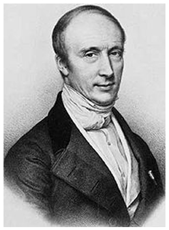

## Theory

  
Augustin-Louis Cauchy   (1789-1857) 
 

Cauchy's equation is an empirical relationship between the refractive index and wavelength of light for a particular transparent material. It is named for the mathematician Augustin-Louis Cauchy, who defined it in 1836.

 The most general form of Cauchy's equation is

 $$n(\lambda)=A+\frac{B}{\lambda^{2}}+\frac{C}{\lambda^{4}}+..; .................(1)$$

 where $n$ is the refractive index, $\lambda$ is the wavelength, B, C, D, etc., are coefficients that can be determined for a material by fitting the equation to measured refractive indices at known wavelengths.

 The refractive index n of the material of the prism for a wavelength $\lambda$ is given by.

 $$n=A+\frac{B}{\lambda^{2}}...............(2)$$

 Where A and B are called Cauchy's constants for the prism.

 If the refractive indices $n1$ and $n2$ for any two known wavelength $\lambda_{1}$ and $\lambda_{2}$ are determined by a spectrometer, the Cauchy's constants A and B can be calculated from the above equation.

 ***Note**: The theory of light-matter interaction on which Cauchy based this equation was later found to be incorrect. In particular, the equation is only valid for regions of normal dispersion in the visible wavelength region. In the infrared, the equation becomes inaccurate, and it cannot represent regions of anomalous dispersion.
